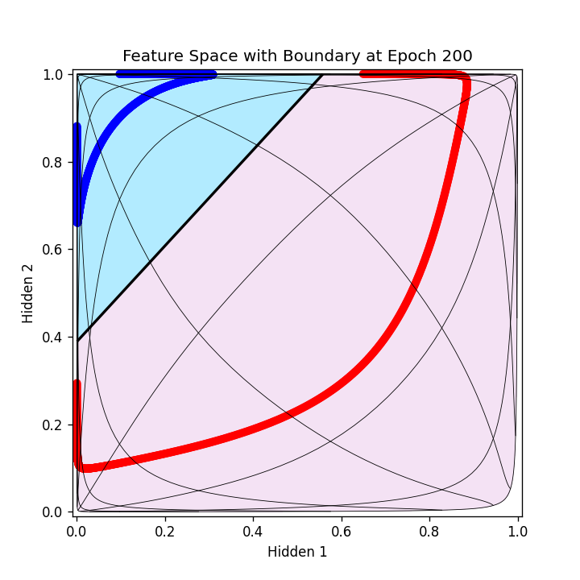

# DeepReplay PyTorch 复现项目

本项目使用 PyTorch 复现了 [DeepReplay](https://github.com/dvgodoy/deepreplay) 项目中的神经网络训练过程可视化功能。通过训练一个简单的二分类神经网络，并在输入空间和特征空间中可视化决策边界和网格变换，展示了模型在训练过程中的动态变化。

## 0. 项目背景与复现说明

本项目参考了 [DeepReplay](https://github.com/dvgodoy/deepreplay) 的核心思想，使用 PyTorch 替代原项目中的 Keras，实现了一个简单的神经网络训练过程，并通过 Matplotlib 生成了静态图和动画来展示训练过程中的输入空间和特征空间变化。

- **参考项目**: [DeepReplay](https://github.com/dvgodoy/deepreplay)
- **复现工具**: PyTorch, NumPy, Matplotlib
- **主要目标**: 使用 PyTorch 重现神经网络训练的可视化过程，生成输入空间和特征空间的决策边界与网格变换。

## 1. 项目功能与实现思路

### 功能
1. **神经网络训练**: 训练一个简单的二分类神经网络，包含一个隐藏层（2个神经元）和一个输出层。
2. **输入空间可视化**: 显示输入空间中的决策边界、网格变换和数据点分布。
3. **特征空间可视化**: 显示隐藏层输出空间中的决策边界、网格变换和数据点分布。
4. **动态展示**: 通过动画展示训练过程中输入空间和特征空间的变化。

### 实现思路
- **数据加载**: 从 `datasets.txt` 文件中加载二维输入数据 `X` 和对应的标签 `y`。
- **模型定义**: 使用 PyTorch 定义一个简单的全连接神经网络，包含 2 个输入节点、2 个隐藏节点和 1 个输出节点，激活函数为 Sigmoid。
- **训练过程**: 使用二元交叉熵损失（BCELoss）和随机梯度下降（SGD）优化器训练模型 200 个 epoch。
- **数据收集**: 在每个 epoch 中收集隐藏层输出、网格变换和决策边界数据。
- **可视化**:
  - **静态图**: 在第 200 个 epoch 生成输入空间和特征空间的静态图，展示决策边界、网格和数据点。
  - **动画**: 生成输入空间和特征空间的动画，展示 200 个 epoch 中决策边界和网格的动态变化。

## 2. 代码库实现条件

### 依赖环境
- **Python**: 3.6 或以上版本
- **PyTorch**: 用于定义和训练神经网络
- **NumPy**: 用于数据处理和网格生成
- **Matplotlib**: 用于生成静态图和动画
- **FFmpeg**: 用于保存动画视频（需安装并配置环境变量）

### 数据要求
- 数据文件 `datasets.txt` 需包含三列：前两列为二维输入特征 `X`，最后一列为二分类标签 `y`（0 或 1）。
- 示例数据格式：
  ```
  0.1  0.2  0
  0.3  0.4  1
  ...
  ```

### 运行步骤
1. 安装依赖：
   ```bash
   pip install torch numpy matplotlib
   ```
2. 安装 FFmpeg（用于生成动画）：
   - 在 Linux/macOS 上：`sudo apt-get install ffmpeg` 或 `brew install ffmpeg`
   - 在 Windows 上：下载 FFmpeg 并添加至环境变量。
3. 将代码保存为两个文件：
   - `input_space_visualization.py`：生成输入空间的静态图和动画。
   - `feature_space_visualization.py`：生成特征空间的静态图和动画。
4. 确保 `datasets.txt` 文件与代码文件在同一目录下。
5. 运行代码：
   ```bash
   python input_space_visualization.py
   python feature_space_visualization.py
   ```

## 3. 结果展示

以下是使用代码生成的两幅静态图和两个动画视频的展示：

### 静态图
1. **输入空间 (Epoch 200)**  
     
   - 显示输入空间中的决策边界（黑色轮廓线）、网格变换（黑色细线）和数据点分布（红蓝散点）。

2. **特征空间 (Epoch 200)**  
     
   - 显示隐藏层输出空间中的决策边界（黑色轮廓线）、网格变换（黑色细线）和数据点分布（红蓝散点）。

### 动画视频
1. **输入空间动画**  
   文件名：`input_space.mp4`  
   - 展示了 200 个 epoch 中输入空间决策边界和网格的动态变化，坐标轴范围固定在 [-1, 1]。

2. **特征空间动画**  
   文件名：`feature_space.mp4`  
   - 展示了 200 个 epoch 中特征空间决策边界、网格和数据点的动态变化，坐标轴范围固定在 [0, 1]。

### 生成结果说明
- **输入空间**: 背景颜色（浅绿色和浅紫色）表示分类区域，黑色轮廓线为决策边界，网格显示输入空间的变换。
- **特征空间**: 数据点和网格被映射到隐藏层空间，决策边界反映模型的分类能力。
- **动画**: 通过逐帧更新展示了训练过程中模型学习动态。

## 4. 注意事项
- 若未安装 FFmpeg，动画保存会失败，可通过安装 FFmpeg 解决。
- 数据文件 `datasets.txt` 需与代码匹配，否则可能导致加载错误。
- 静态图和动画的输出文件会保存在当前工作目录下。

